# Custom IP


**DISCLAMER 1:** This tutorial doesn't work on Bedrock/Windows 10/Pocket Edition servers! They don't support SRV records.

**DISCLAMER 2:** If you plan on getting free web hosting, don't select .tk domains if you are using recommended Free Webhosting InfinityFree. You can't register .tk domain on it. 

**DISCLAMER 3:** If you already own domain on Freenom or any other register, you can skip some of the domain registration steps and when you get to changing Nameservers of the domain, if you are unsure how you do it on your domain register, Google can help you! 

**DISCLAMER 4:** IP won't change on the panel! You can use both old and new one IP you created with help of this tutorial to connect to your server.

 **DISCLAMER 5:** If you are doing this tutorial from the mobile phone or the tablet, on the Cloudflare page after step number **14\)**, make sure to click on the context menu of your browser \(usually `...` three vertical dots\) and check `Request Desktop Site`. If by any chance you don't have such option, use your computer or you can't complete all the steps successfully. 



If you prefer watching a video instead, check out [this video](https://youtu.be/S_0yHPfA_WA) kindly provided by [Zacky26/qtChan](https://www.youtube.com/channel/UCGIqnGB5CRCODz77OJgoY-w) 


**1\)** Get yourself a free domain from [https://freenom.com/](https://freenom.com/) _"mynewip" is just an example. Instead of it type in whatever you want your IP to start with, server name preferably._ 

 

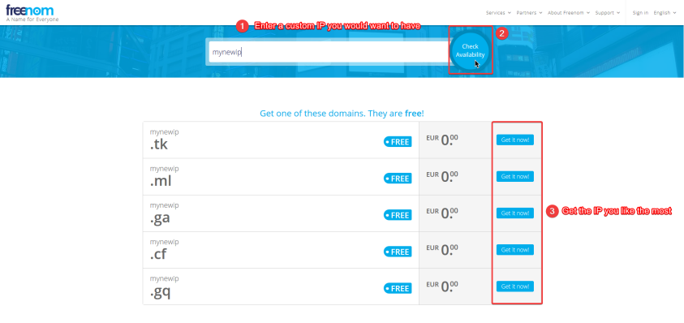

 **2\)** Select the IP you like the most 

 

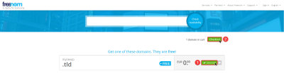

**3\)** Change domain duration from 3 to 12 Months 

 

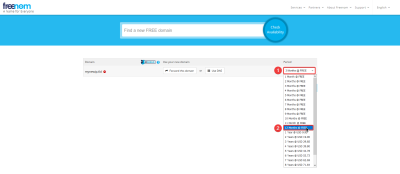

 **4\)** Enter your email address 

 

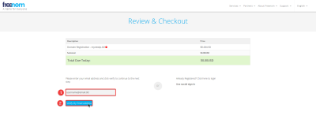

**5\)** Open your email inbox in new tab and open email sent by Freenom _If you don't see it, make sure to check "Spam" folder_  

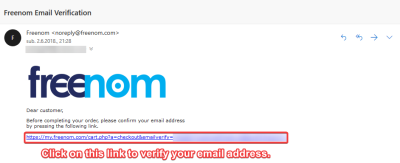

 **6\)** On the next page enter any random info but password and click the `Continue` button

 **7\)** Go to [CloudFlare](https://cloudflare.com/)

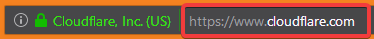 

 **8\)** Click `Sign up` button then register as usual

**9\)** On this page enter the domain \(your new IP\) you registered on the [Freenom](https://freenom.com/)

 

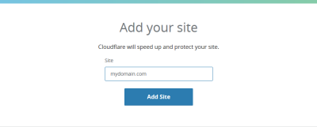

 **10\)** Click `Next` 

 

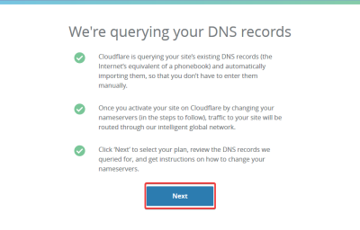

 **11\)** Choose **Free** plan then click on the `Confirm plan`  

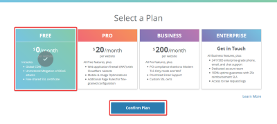

 **12\)** Click on the `Purchase` 

 

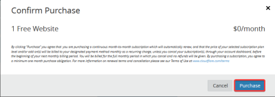

 **13\)** Once you get to this page, it is time to link your domain to your Minecraft server

  

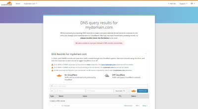

 **14\)** Change `A` to `SRV` record 

 

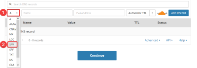

 **15\)** Type in following information: **Service name:** `_minecraft` If you want to use yourdomain.com as your servers IP, type `@` in the **Name** field or For `play.yourdomain.com`, type `play` in the **Name** field or For `mc.yourdomain.com`, type `mc` in the **Name** field or You can type anything in **Name** field for example: If you type `something` you can use `something.yourdomain.com` to connect to your Minecraft server _If you want to use **yourdomain.com**, **play.yourdomain.com** as well as / or **mc.yourdomain.com**, click on `Click to configure field` after adding one SRV Record and repeat steps **15\)** - **21\)**_ **NOTE:** `yourdomain.com` is just an example, replace it with your domain using imagination 

 

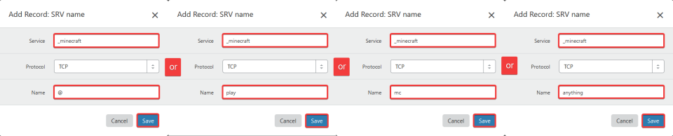

**16\)** Click on the `Save` button

**17\)** In new windows pop up type in following information: **Priority:** `0` **Weight:** `5` _**Don't `Save` yet!**_ 

_\*\*\*\*_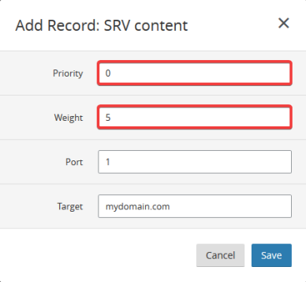 

 **18\)** Open the your host's panel in new tab 

 **19\)** Copy and enter following information from Panel to the Cloudflare: 

 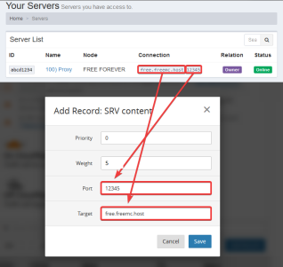 

**20\)** Click the `Save` button

**21\)** Click on the `Add Record` button 

 

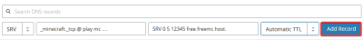

 **22\)** Once you get something like this: ...  

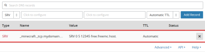

 **23\)** Change `SRV` to `A` Record 

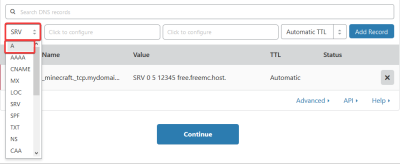 

**24\)** In `Name` field type `@` and in `IPv4 Address` field type `161.129.154.71`, click on Orange cloud to turn it Gray, click on the `Add Record` button

**25\)** Click Continue

Don't close Cloudflare page yet! We will need it in a second! 

**26\)** Go back to the Freenom tab and click the `Manage Domain` _If you closed it, don't worry! Go to_ [_Freenom Client Area Domains_](https://my.freenom.com/clientarea.php?action=domains)\_\_

**27\)** Select `Management Tools`, then click on the `Nameservers`

**28\)** Follow the screenshot below: ... _Cloudflare tab on Left. Freenom tab on right_

\_\_

**29\)** ~~Once you see page that looks something like this~~: ... 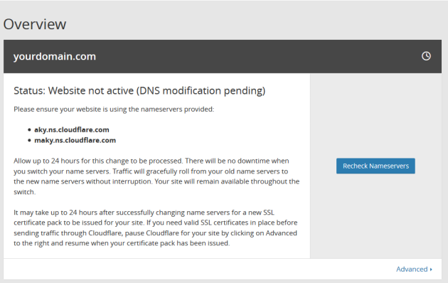 __


Cloudflare changed how this page looks. If you did everything correctly, the custom ip address you created following this tutorial will work


Click on the `Recheck Nameservers` button and if you see "Zone Verified" notification, you can start using your new IP right away! If you don't, Domain verification takes usually few minutes, no more than an hour. __~~If you see page like this one~~: ... 

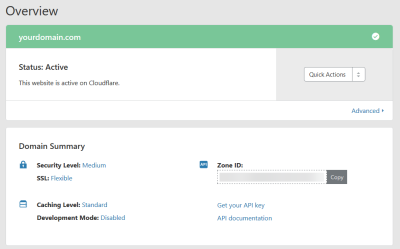 


Cloudflare changed how this page looks. If it says Active somewhere around, you should be fine!


You can start using right away or in few minutes.Sometimes it can take bit longer for your custom ip to activate depending on speed of your Internet Service Provider's DNS servers.

