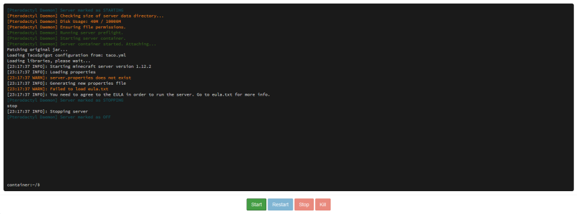
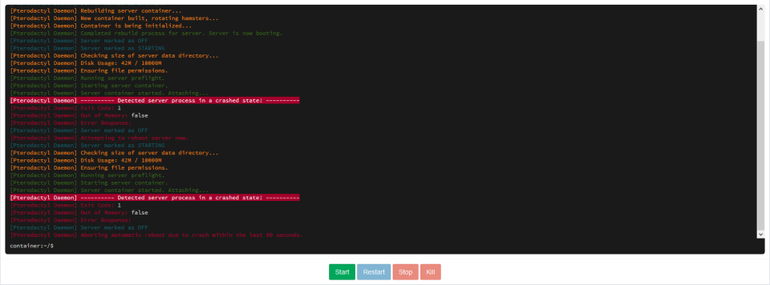

# FAQ

## How do I get rid of this EULA Error?  

 Open `File Manager` &gt; Open `eula.txt` &gt; Change `eula=false` to `eula=true` &gt; Click on the `Save` button at the end of the page &gt; Go back to the `Console` &gt; Start your server

## My server is not starting! \(Exit Code: 1\)  

Don't panic! This can be fixed easily. Follow [Version](version/general.md) to fix your issue.

## I am a cracked player. How can I turn my server cracked mode to play on it?

Start your server at least once &gt; Go to the `File Manager` &gt; Open `server.properties` &gt; Find `online-mode=true` \(usually around line 35\) &gt; Change `true` to `false` &gt; Click on the `Save` button at the end of the page &gt; Go back to the `Console` &gt; Restart or Start your server 

**Additional setup** _This only works if your server is Spigot \(PaperSpigot, TacoSpigot\) or Bukkit._ As your server will be running in the cracked mode, anyone can steal each other's account by simply changing names! To prevent that we are going to add simple plugin named "[AuthMe Reloaded](https://www.spigotmc.org/resources/authmereloaded.6269/)". Download [AuthMe Reloaded](https://www.spigotmc.org/resources/authmereloaded.6269/) &gt; Go to the your host's Panel &gt; Click on your server &gt; Open `File Manager` &gt; Go into the `plugins` folder \(Make one if you don't have one already. Make sure your server is [Java Edition](version/java-edition.md)!\) &gt; Drag & Drop "AuthMe-x.x.x.jar" to the File Manager Windows **OR** Click on the `Upload` Button and Select the downloaded "AuthMe-x.x.x.jar" &gt; Wait 'till Blue Line gets Green \(This is **very** important! You must be patient if you want plugin to work!\) &gt; After done &gt; Go back to the `Console` &gt; Restart or Start your server Now when you join your server make sure to **/register** and later on you can **/login** every next time you join. This will prevent people from stealing your's and accounts of the others as it will require them to enter the password! 

\(_Optional_\) If you also want to enable skins on your cracked server and have fun with changing skins also do next: Download [Skins Restorer](https://www.spigotmc.org/resources/skinsrestorer.2124/) &gt; Go to the your host's Panel &gt; Click on your server &gt; Open `File Manager` &gt; Go into the `plugins` folder &gt; Drag & Drop "SkinsRestorer.jar" to the File Manager Windows **OR** Click on the `Upload` Button and Select downloaded "SkinsRestorer.jar" &gt; Wait until the Blue Line gets Green \(This is **very** important! You must be patient if you want plugin to work!\) &gt; Go back to the `Console` &gt; Restart or Start your server

## Are there any plugin, mods or player slots limits?

No! We don't limit number of plugins, mods and player slots on server. You can upload as many plugins and mods as you want and set player slots to any value.


Be careful! Uploading many plugins, mods and setting your player slots to very large number can cause some issues to your server and degrade the performance!


## Can I change my servers version? Do you support Bukkit, Spigot, Forge? Can I have MCPE, Bedrock, Windows 10 Edition or Console Edition server?

 Yes! Yes! And Yes! You can change your servers version following [Version](version/general.md). We support Vanilla, Bukkit, Spigot, Forge, even Bungeecord! You can also have Bedrock Edition server that supports all of the Bedrock editions such as Minecraft: Pocket Edition, Console Edition, Windows 10 edition, and others! 

PaperSpigot is optimized version of Spigot. The Spigot is more optimized Version of Bukkit. _Confusing!_ 

If you plan on hosting Minecraft server with plugin support we recommend using PaperSpigot or TacoSpigot \(We simply call them Spigot\). They both support Spigot and Bukkit plugins! For explained tutorial refer to the [Java Edition](version/java-edition.md). Do you want to host pure Vanilla server? No problem! Follow [Java Edition](version/java-edition.md) tutorial and download Vanilla server version. 

Prefer modded Minecraft? We got your back! Follow the [Forge](version/forge.md) tutorial to get modded! Bedrock Edition player \(Pocket, Windows 10, Console Edition\)? Follow [Bedrock Edition](version/bedrock-edition.md) tutorial to turn your FreeMC.Host server Bedrock! Need a free Bungeecord server? Follow the [Bungeecord](bungeecord.md) tutorial!

## Can I use custom Server JAR on my server?

 Sure you can! On the Panel, Go into `File Manager` &gt; Click on the `Upload` and select your JAR **OR** Drag & Drop your Custom JAR to the File Manager window &gt; Wait until the Blue line gets Green \(This is **very** important! You must be patient if you want your Custom JAR to work!\) &gt; Reload page &gt; Right click on your uploaded Custom JAR &gt; Select `Rename` &gt; Change JAR name to `server.jar` \(it must be exactly named like this! All low case!\) &gt; Go back to the `Console` &gt; `Kill` your server if it's already Started &gt; `Start`

## How do you add/install/upload plugins?

 To use plugins your server must be Spigot or Bukkit. If you changed your server version and software to anything else than Bukkit or Spigot, follow [Java Edition](version/java-edition.md). 

First download plugins. If you don't know, websites you can download plugins from are: [SpigotMC](https://spigotmc.org/resources) and [DevBukkit](https://dev.bukkit.org/). Some plugins on SpigotMC website are only supported on Spigot! Spigot supports all Bukkit plugins as well! 

Once you got some of the plugins &gt; Open your host's Panel &gt; Click on your servers name &gt; Go to the `File Manager` &gt; Open the `plugins` folder \(If you don't folder already, create it. Make sure you server is Spigot or Bukkit!\) &gt; Drag & Drop the plugins from your Downloads folder to the File Manager window **OR** Click on the `Upload` button, select plugin you want to upload &gt; Wait until the Blue Line gets Green \(This is **very** important! You must be patient if you want plugin/s to work!\) &gt; Go back to the `Console` &gt; Restart or Start your server

## How do you add/install/upload mods?

 If you have a modpack you want to play - Download Server version of the modpack and upload it to your Minecraft server using File Manager **OR** If you are getting `File upload aborted by the server` that means that file is larger than 100MB and you can't upload it using File Manager. Instead you can use [File Transfer](file-transfer/general.md) &gt; After you uploaded it, Reload / Open File Manager &gt; Right click on your modpack archive and select `Decompress` &gt; Right Click`modpack_name.jar` or `forge-xxxx.jar` and Rename to the `server.jar` 

If you are not using Modpack, To use mods your server must be Forge. To install Forge follow [Forge](version/forge.md) tutorial. 

After you installed Forge, it's time to upload some mods! 

Open your Minecraft folder &gt; Open `mods` folder &gt; Select all mods in there &gt; Right Click &gt; Send to &gt; Compressed \(Zipped\) Folder \(This will make a new .zip archive with all selected mods in it! You can also use WinRAR or 7-Zip to compress mods, but select .zip archive! Otherwise you can't decompress it using File Manager\) &gt; Name it however you want &gt; Go to the your host's panel &gt; Click on your server &gt; Open `File Manager` &gt; Open `mods` folder \(Create it if you don't have it already\) &gt; In it upload .zip archive containing your mods, Drag & Drop Archive from your Minecraft mods folder to the Panel's File Manager **OR** Click on the `Upload` button &gt; Navigate to your Minecraft mods folder and select .zip archive &gt; Wait 'till Blue Line gets Green \(This is **very** important! You must be patient if you want mods to work!\) &gt; After done &gt; Restart or Start your server

## Can I install mods and plugins together?

 Well... Yes and No. If you want 1.7.10 server with Mods and plugins, it is as easy as following [Forge](version/forge.md) but installing Thermos, Not the Forge. Then you can add Forge mods in mods folder, and Spigot and Bukkit plugins in the plugins folder. 

For 1.10.2 and up, Follow the [Forge](version/forge.md) with version you want your modded + plugin server to be and read **BOUNS** at the end of the tutorial. **NOTE:** It will **only** support [SPONGE plugins](https://ore.spongepowered.org/)!

## How do I change player slots/limit?

 Go to the your host's panel &gt; Click on your server's name &gt; Go into the `File Manager` &gt; Open `server.properties` &gt; Find `max-players=20` \(Usually around line 20\) &gt; Change `20` to player slots/limit you want. Remember, We don't limit player slots, you can set it to any value you want &gt; Click on the `Save` button at the end of the page &gt; Go back to the `Console` &gt; Restart or Start server

## How can I change my Server Icon/logo picture?

 First get yourself image that you want as your server icon &gt; Download it \(Right Click &gt; Save image as...\) &gt; Go to the [PicResize](http://picresize.com/) &gt; Upload your downloaded picture &gt; Under `Resize my picture`, change `Make my picture: 50% smaller` to `Custom size...` &gt; Set both **Width** and **Height** to 64 pixels &gt; Under `Save as` Change Image format to `PNG` &gt; Click on the Yellow `I'm Done, Resize my Picture!` button &gt; Click on the `Save to Disk` and download the image. 

Go to the your host's panel &gt; Click on your server name &gt; Go into the `File Manager` &gt; Drag & Drop resized image from PicResize into the File Manager window **OR** Click on the `Upload` button and select download resized image from PicResize &gt; Wait 'till Blue line gets Green &gt; Reload page &gt; Right click uploaded image &gt; Rename &gt; Change name to `server-icon.png` &gt; Go back to the `Console` &gt; Restart or Start your server

## How do you change MOTD?

 Design a cool MOTD on [MCTools](https://mctools.org/motd-creator) 

When you are done: 

For Minecraft Vanilla, Bukkit, Spigot, Forge server, under `For the server.properties file:`, click your generated MOTD next to `motd=`and copy it. 

If you are running Bungeecord network, under `For BungeeCord's config.yml file:` click on your generated MOTD next to `motd:` and copy it. 

Go to the your host's panel &gt; Click on your server name \(If it's a bungeecord network click on your bungeecord sevrer name\) &gt; Go into the `File Manager` &gt; if your server is Vanilla, Bukkit, Spigot, Forge... open `server.properties`then find `motd=A Minecraft Server` \(usually around line 41, end of the file\) and replace `A Minecraft Server` with MOTD you copied from MCTools website 

If it's bungeecord server open config.yml then find `motd: '&1Another Bungee server'` \(usually around line 6\) and replace `&1Another Bungee server` with MOTD you copied from MCTools website \(Don't remove `'` after `motd:` and another `'` at the end of MOTD!\) &gt; Click on the `Save` Button at the end of the page &gt; Go back to the `Console` &gt; Restart or Start your server

