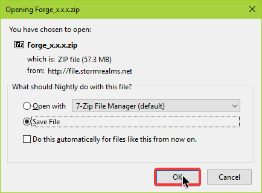

# Forge

**1\)** Select Forge version you want your server to be:

\*\*\*\*[**1.12.2**](http://files.cyclize.cf/forge/1.12.2.zip) _\*\*_

\*\*\*\*[**1.11.2** ](http://files.cyclize.cf/forge/1.11.2.zip)

\*\*\*\*[**1.10.2**](http://files.cyclize.cf/forge/1.10.2.zip)

\*\*\*\*[**1.9.4**](http://files.cyclize.cf/forge/1.9.4.zip)

\*\*\*\*[**1.8.9**](http://files.cyclize.cf/forge/1.8.9.zip)

\*\*\*\*[**1.7.10**](http://files.cyclize.cf/forge/1.7.10.zip)

\*\*\*\*[**1.6.4**](http://files.cyclize.cf/forge/1.6.4.zip)

**Thermos** \(_Forge with Bukkit and Spigot plugin support_\)

[**1.7.10**](https://files.cyclize.cf/forge/thermos/server.jar)

 _\*\*_

\*\*\*\*

**2\)** Open up your host's panel, login if you are not logged in already and select you server

\*\*\*\*

**3\)** Go to the `File Manager`

\`\`\*\*\*\*

**4\)** Select all files, deselect `eula.txt`, Click the `Mass Actions` Button then `Delete files`

\`\`\*\*\*\*

**5\)** Click on the `Upload` button

\*\*\*\*

**6\)** Select downloaded `Forge_x.x.x.zip` and click `Open`\*\*\*\*

**7\)** When uploaded \(Blue line turns to Green line\), ...

... Reload/Refresh the page

\*\*\*\*

**8\)** Right click on the `Forge_x.x.x.zip` and Select `Decompress`\*\*\*\*

**9\)** Once you get something like this: ...

... go back to the console

\*\*\*\*

**10\)** Start your server

## **BONUS**

**Installing Pixelmon** Universal Pixelmon Mod is more than 300MB, thus exceeding File Manager upload limit. Use [this](https://dl.reforged.gg/3fEzabP) to download latest Pixelmon server side only mod that's just bit over 11MB! **Running plugins on Forge 1.10.2+ without Thermos** Using SpongeForge Forge mod you are able to run Sponge plugins on your Forge modded server!

**1\)** Download SpongeForge mod for your version of Forge server:

\*\*\*\*[**1.10.2**](https://repo.spongepowered.org/maven/org/spongepowered/spongeforge/1.10.2-2477-5.2.0-BETA-2793/spongeforge-1.10.2-2477-5.2.0-BETA-2793.jar%20)\*\*\*\*

\*\*\*\*[**1.11.2**](https://repo.spongepowered.org/maven/org/spongepowered/spongeforge/1.11.2-2476-6.1.0-BETA-2792/spongeforge-1.11.2-2476-6.1.0-BETA-2792.jar%20)\*\*\*\*

\*\*\*\*[**1.12.2**](https://repo.spongepowered.org/maven/org/spongepowered/spongeforge/1.12.2-2768-7.1.5/spongeforge-1.12.2-2768-7.1.5.jar%20)

**2\)** Place downloaded Spongeforge .jar inside your `mods` folder

**3\)** Download [Sponge plugins](https://ore.spongepowered.org/%20)

**4\)** Upload Sponge plugins to the `mods` folder

**5\)** Restart the server

**6\)** `Optional` Edit plugin configuration files inside `config` folder

